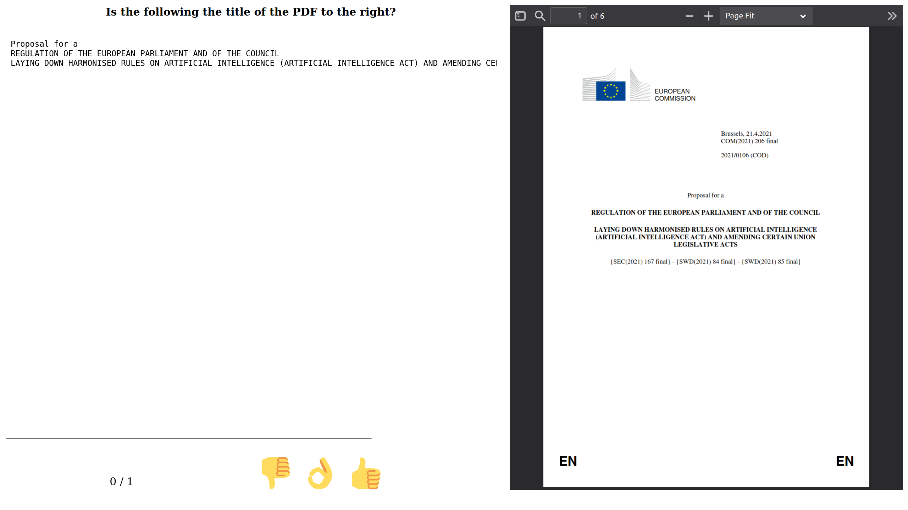

# Evaluation tool

This module contains a browser-based tool to quickly conduct evaluations concerning text extraction from PDF.

The module is structured as follows:

- `app.py`: The main executable of the evaluation tool, run this to start the server.
- `pages/`: Code for other parts of the evaluation tool.
- `assets/`: Folder containing the source files mentioned [later](#evaluation-csv-file-format). Can be either placed into the folder itself or symlinked.
- `evaluations/`: The source files for evaluations displayed in the tool. The exact format is discussed [below](#evaluation-csv-file-format).

The following is an example for how one question/task of an evaluation might look like:



As the content of each task is rendered as HTML, various configurations are possible, as well.

## Evaluation (CSV) file format

- `id`: Id for each row, has to be unique across the evaluation (but two different evaluations are allowed to reuse ids). Not visible to the user.
- `task`: Question/task shown at the top of the left half of the evaluation page. Rendered as raw text.
- `content`: Main content to evaluate, shown on the left half of the evaluation page. Content is rendered as HTML, so any HTML tags are valid. If you wish to show a "raw" text, wrap it inside something like a `<pre>` block.
- `source`: Source (PDF) document referred to, shown on the right half of the page. Should be a link to a PDF file present or symlinked in the `assets`.
- `result`: Feedback of the user for the row. Will be *POSITIVE* (👍), *NEUTRAL* (👌), or *NEGATIVE* (👎). Should be empty (e.g. `None` when writing the file using Pandas) when starting a new evaluation.

For an example, see `evaluations.csv`. This file creates the screenshot shown in the introduction section.

## Setup and usage

- (Optionally) Create a new virtual environment
    ```bash
    python -m venv venv
    source venv/bin/activate
    ```
- Install the necessary libraries
    ```bash
    pip install -r requirements.txt
    ```
- Run the server
    ```bash
    python3 app.py
    ```
- Go to [http://0.0.0.0:8050/](http://0.0.0.0:8050/)